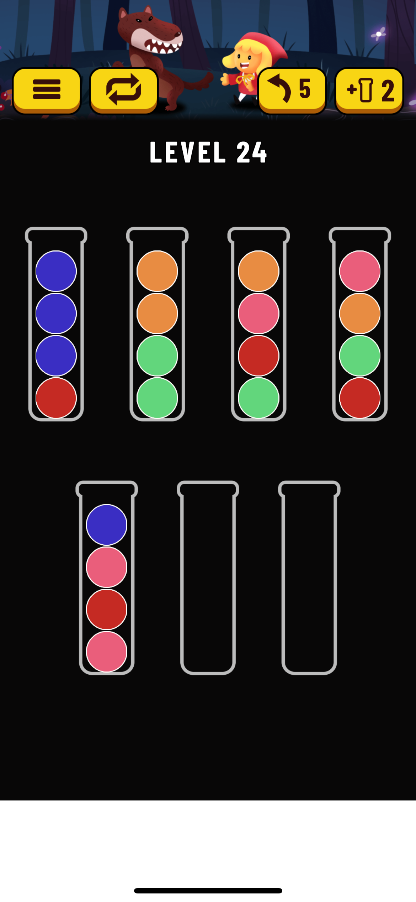

# ballsorting
Solve ballsorting

## Setup

### Environment

Create a new environment and install dependencies. Note that this project is only compatible with python `3.10`. If you are using Conda, you can run the following commands:

```bash
conda create --name ballsorting
conda activate ballsorting
conda install python=3.10
pip install -r requirements.txt
```

After installing python dependencies, you should be able to run CLI input:

```bash
python -m manager.cli_input
```

You can key in the colours of the balls of each tube from bottom up. For example, if your puzzle looks something like this:



You can key in input as follow:

```
7
4
red blue blue blue
lime lime orange orange
lime red pink orange
red lime orange pink
pink red pink blue


```

You can name the colour in whatever way you want, however, you need to make sure that the same colour is spelled the same everywhere, and consecutive colours are split by one white space.

### Data

An important component of this project is the image recognizer, and for that, you need to input your own training data and do the training yourself. You need to put the data in `data` subfolder (create one yourself!). Take note of the following:

* Images must be of the same dimension.
* Images must be named incrementally from $1$ to $n$.
* Any extension is accepted, but images must have the same extension.
* Target must have $n$ lines representing how many tubes there are in the corresponding image.

I have around 150 images, and that is sufficient for the model to accurately tell the number of tubes in an image.

The next step is to provide data on which pixels to look at given the number of tubes, to accurately read the colours. The file `colours.json` has the following structure:

```json
{
    "[number of tubes]": {
        "positions": [
            {
                "x": "[X position of the top ball to look at]",
                "y": "[Y position of the top ball to look at]"
            }
        ],
        "distance": "[Distance of consecutive balls in one tube]"
    }
}
```

Note that number of elements in the `positions` array must be the same as the number of tubes declared.

The file `colour_names.json` is then used to tell the name of the colour given a pixel value. You may reuse the sample `colour_names.json`.

### Create model

To run the training, run the following python script:

```bash
python -m identification.init
```

This does training on your data, and save the model to the `data` folder.

You can now run the model. Save an image in your `data` folder with name `image.png` (or `image.jpg` if you use JPG extension), and run the following:

```bash
python -m manager.file_input data/image.png
```
